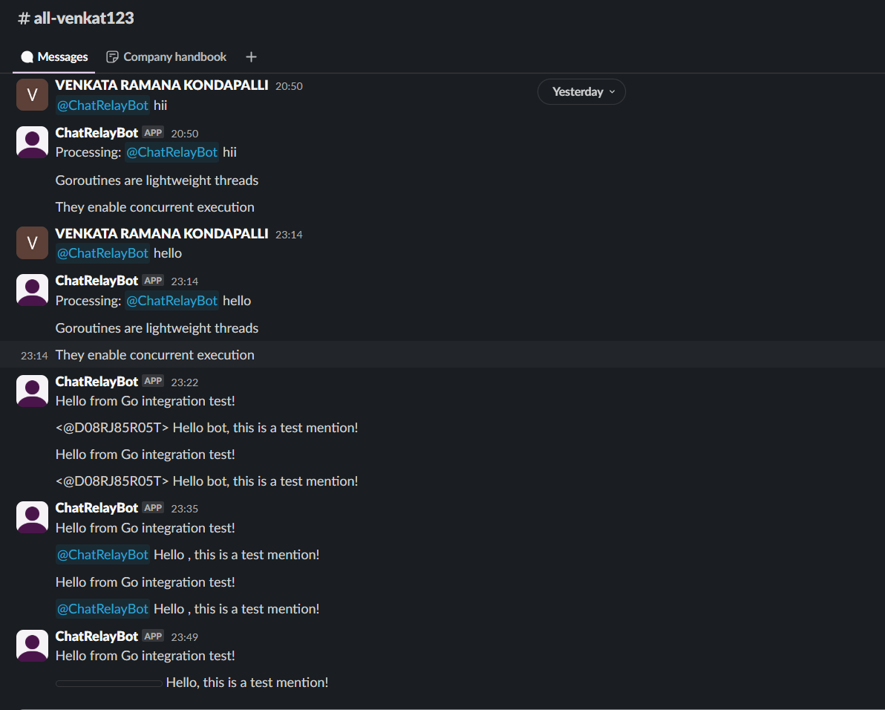

# ChatRelayBot Documentation


## Project Overview
ChatRelayBot is a Slack bot designed to process user mentions and direct messages, relay them to a backend service, and return responses. It leverages OpenTelemetry for tracing and uses a worker pool to handle concurrent tasks efficiently. The bot operates in Slack's Socket Mode for real-time event handling.

### Architecture
- **Slack Integration**: Listens to events such as mentions and direct messages using Slack's Socket Mode.
- **Backend Service**: Processes user queries and returns responses in JSON or Server-Sent Events (SSE) format.
- **Worker Pool**: Manages concurrent tasks to ensure efficient processing.
- **OpenTelemetry**: Provides distributed tracing for monitoring and debugging.

---

## Setup and Running Instructions

### 1. Create and Configure a Slack App
1. Go to [Slack API Apps](https://api.slack.com/apps) and create a new app.
2. Under **OAuth & Permissions**, add the following scopes:
   - `app_mentions:read`
   - `chat:write`
   - `channels:history`
   - `groups:history`
   - `im:history`
3. Enable **Event Subscriptions**:
   - Add a Request URL (e.g., `http://localhost:8080/events`).
   - Subscribe to the following events:
     - `app_mention`
     - `message.im`
4. Under **Socket Mode**, enable it and generate an App-Level Token with the `connections:write` scope.

---

### 2. Obtain and Set Up Slack Tokens
- **Bot User OAuth Token**: Found under **OAuth & Permissions** after installing the app to a workspace.
- **App-Level Token**: Found under **Socket Mode** settings.

---

### 3. Environment Variables
 - Create a `.env` file in the root directory with the following variables:
- SLACK_BOT_TOKEN=your-bot-user-oauth-token
 - SLACK_APP_TOKEN=your-app-level-token
 - OTEL_EXPORTER_OTLP_ENDPOINT=your-opentelemetry-endpoint
-  BACKEND_URL=http://localhost:8080/v1/chat/stream
 - OTEL_EXPORTER=console
 - SLACK_TEST_CHANNEL=your-test-channel-id
  -PORT=8080
 - SLACK_CHANNEL=your-channel-id
  - SLACK_BOT_USER_ID=your-bot-user-id


<!-- ### 4. Build and Run the Application Locally
Install dependencies:
Build the application:
Run the application:

### 5. Install the Bot into a Slack Workspace
Go to your Slack App's Install App section and install it into your workspace.
Invite the bot to a channel using /invite @chatrelaybot.
### 6. Interact with the Bot
Mention the Bot: Use @chatrelaybot <your query> in a channel.
Direct Message: Send a message directly to the bot.

### Notes
Ensure the backend service is running and accessible at the URL specified in BACKEND_URL.
Use OpenTelemetry-compatible tools to monitor traces for debugging and performance analysis.

Here’s an updated and expanded documentation to address the additional requirements:

```markdown
# ChatRelayBot Documentation

## Project Overview
ChatRelayBot is a Slack bot designed to process user mentions and direct messages, relay them to a backend service, and return responses. It leverages OpenTelemetry for tracing and uses a worker pool to handle concurrent tasks efficiently. The bot operates in Slack's Socket Mode for real-time event handling.

### Architecture
- **Slack Integration**: Listens to events such as mentions and direct messages using Slack's Socket Mode.
- **Backend Service**: Processes user queries and returns responses in JSON or Server-Sent Events (SSE) format.
- **Worker Pool**: Manages concurrent tasks to ensure efficient processing.
- **OpenTelemetry**: Provides distributed tracing for monitoring and debugging.

---

## Setup and Running Instructions

### 1. Create and Configure a Slack App
1. Go to [Slack API Apps](https://api.slack.com/apps) and create a new app.
2. Under **OAuth & Permissions**, add the following scopes:
   - `app_mentions:read`
   - `chat:write`
   - `channels:history`
   - `groups:history`
   - `im:history`
3. Enable **Event Subscriptions**:
   - Add a Request URL (e.g., `http://localhost:8080/events`).
   - Subscribe to the following events:
     - `app_mention`
     - `message.im`
4. Under **Socket Mode**, enable it and generate an App-Level Token with the `connections:write` scope.

---

### 2. Obtain and Set Up Slack Tokens
- **Bot User OAuth Token**: Found under **OAuth & Permissions** after installing the app to a workspace.
- **App-Level Token**: Found under **Socket Mode** settings.

---

### 3. Environment Variables
Create a `.env` file in the root directory with the following variables:
```plaintext
SLACK_BOT_TOKEN=your-bot-user-oauth-token
SLACK_APP_TOKEN=your-app-level-token
OTEL_EXPORTER_OTLP_ENDPOINT=your-opentelemetry-endpoint
BACKEND_URL=http://localhost:8080/v1/chat/stream
OTEL_EXPORTER=console
SLACK_TEST_CHANNEL=your-test-channel-id
PORT=8080
SLACK_CHANNEL=your-channel-id
SLACK_BOT_USER_ID=your-bot-user-id
```

--- -->

### 4. Build and Run the Application Locally
1. Install dependencies:
   ```sh
   go mod tidy
   ```

2. Run the application:
   ```sh
   go run main.go
   ```
3. Iam keeping logs in terminal

---

### 5. Install the Bot into a Slack Workspace
1. Go to your Slack App's **Install App** section and install it into your workspace.
2. Invite the bot to a channel using `/invite @chatrelaybot`.

---

### 6. Interact with the Bot
- **Mention the Bot**: Use `@chatrelaybot <your query>` in a channel.
- **Direct Message**: Send a message directly to the bot.
- 

---

## Design Decisions

### Slack Connection Method
- **Socket Mode**: Chosen for real-time event handling without requiring public URLs or additional infrastructure like ngrok. This simplifies local development and deployment.

### Streaming Implementation
- **Server-Sent Events (SSE)**: Used for efficient streaming of backend responses to the bot. This ensures low latency and supports long-running responses.

### Error Handling Strategies
- Centralized error handling with structured logging for better debugging.
- Graceful fallback mechanisms for Slack API errors, such as retries with exponential backoff.

### Concurrency Patterns
- **Worker Pool**: Implemented to handle concurrent tasks efficiently, ensuring the bot can process multiple events without overwhelming system resources.

### OpenTelemetry Setup
- Integrated OpenTelemetry for distributed tracing, enabling detailed performance monitoring and debugging across the bot and backend service.

### Trade-offs
- **Socket Mode** simplifies development but requires managing app-level tokens securely.
- **Worker Pool** improves concurrency but adds complexity to task management.

---

## Scalability, Performance, and Observability Documentation

### Scalability
- **Horizontal Scaling**: The bot can be scaled by running multiple instances, each handling a subset of events.
- **Worker Pool**: Ensures efficient use of resources by limiting the number of concurrent tasks.

### Performance
- **Low Latency**: SSE ensures fast response streaming.
- **Efficient Resource Usage**: Worker pool prevents resource exhaustion during high traffic.

### Observability
- **Tracing**: OpenTelemetry provides end-to-end tracing for monitoring and debugging.
- **Metrics**: Custom metrics can be added to monitor event processing times and error rates.
- **Logging**: Structured logs are used for better analysis and debugging.

---

## Testing Instructions

### Unit Tests
1. Run all unit tests:
   ```sh
   go test ./... -v
   ```

### Integration Tests
1. Ensure the backend service is running.
2. Run integration tests:
   ```sh
   go test -tags=integration ./... -v
   ```

### Mock Testing
- Use mock Slack APIs to simulate events and validate bot behavior.

### End-to-End Testing
1. Deploy the bot in a test Slack workspace.
2. Interact with the bot using test scenarios (e.g., mentions, direct messages).
3. Verify responses and traces using OpenTelemetry-compatible tools.


# Slack Marketplace Publication Plan

## 1. Understand Slack’s Review Guidelines
- Review Slack’s [App Directory Guidelines](https://api.slack.com/partners/app-review) to ensure compliance with their requirements.
- Key considerations:
  - Provide a clear and compelling app description.
  - Ensure the app is functional, user-friendly, and bug-free.
  - Adhere to Slack’s security and privacy standards.

---

## 2. Security Best Practices
### Token Management
- Use environment variables to securely store tokens (e.g., `SLACK_BOT_TOKEN`, `SLACK_APP_TOKEN`).
- Avoid hardcoding tokens in the source code or exposing them in public repositories.

### Data Handling
- Encrypt sensitive data in transit using HTTPS.
- Avoid storing unnecessary user data. If storage is required, ensure it is encrypted at rest.
- Implement data retention policies to delete old or unused data.

### Input Validation
- Sanitize and validate all user inputs to prevent injection attacks.
- Use Slack’s SDKs to handle API requests and responses securely.

---

## 3. Implement Robust OAuth 2.0 for “Add to Slack” Flow
- Use Slack’s OAuth 2.0 flow to allow users to install the bot securely.
- Steps:
  1. Create an **OAuth Redirect URL** in your Slack App settings.
  2. Implement the OAuth flow in your backend to exchange the authorization code for an access token.
  3. Store the access token securely in your database.
- Scopes:
  - Request only the necessary scopes (e.g., `app_mentions:read`, `chat:write`, etc.).
- Example OAuth flow:
  ```plaintext
  User clicks "Add to Slack" → Redirect to Slack's authorization page → User grants permissions → Redirect back to your app with an authorization code → Exchange code for access token.

4. App Manifest Configuration
Use Slack’s App Manifest to define your app’s configuration.
Include:
App name, description, and long description.
Required scopes and event subscriptions.
Redirect URLs for OAuth.
Bot user settings (e.g., display name, default username).
Example manifest snippet:

display_information:
  name: ChatRelayBot
  description: A bot to relay messages and provide real-time responses.
  long_description: ChatRelayBot processes user mentions and direct messages, relays them to a backend service, and returns responses efficiently.
features:
  bot_user:
    display_name: ChatRelayBot
    always_online: true
oauth_config:
  redirect_urls:
    - https://yourapp.com/oauth/callback
  scopes:
    bot:
      - app_mentions:read
      - chat:write
      - channels:history
- 

Here’s a detailed Slack Marketplace Publication Plan for your bot:

```markdown
# Slack Marketplace Publication Plan

## 1. Understand Slack’s Review Guidelines
- Review Slack’s [App Directory Guidelines](https://api.slack.com/partners/app-review) to ensure compliance with their requirements.
- Key considerations:
  - Provide a clear and compelling app description.
  - Ensure the app is functional, user-friendly, and bug-free.
  - Adhere to Slack’s security and privacy standards.

---

## 2. Security Best Practices
### Token Management
- Use environment variables to securely store tokens (e.g., `SLACK_BOT_TOKEN`, `SLACK_APP_TOKEN`).
- Avoid hardcoding tokens in the source code or exposing them in public repositories.

### Data Handling
- Encrypt sensitive data in transit using HTTPS.
- Avoid storing unnecessary user data. If storage is required, ensure it is encrypted at rest.
- Implement data retention policies to delete old or unused data.

### Input Validation
- Sanitize and validate all user inputs to prevent injection attacks.
- Use Slack’s SDKs to handle API requests and responses securely.

---

## 3. Implement Robust OAuth 2.0 for “Add to Slack” Flow
- Use Slack’s OAuth 2.0 flow to allow users to install the bot securely.
- Steps:
  1. Create an **OAuth Redirect URL** in your Slack App settings.
  2. Implement the OAuth flow in your backend to exchange the authorization code for an access token.
  3. Store the access token securely in your database.
- Scopes:
  - Request only the necessary scopes (e.g., `app_mentions:read`, `chat:write`, etc.).
- Example OAuth flow:
  ```plaintext
  User clicks "Add to Slack" → Redirect to Slack's authorization page → User grants permissions → Redirect back to your app with an authorization code → Exchange code for access token.
  ```

---

## 4. App Manifest Configuration
- Use Slack’s [App Manifest](https://api.slack.com/reference/manifests) to define your app’s configuration.
- Include:
  - App name, description, and long description.
  - Required scopes and event subscriptions.
  - Redirect URLs for OAuth.
  - Bot user settings (e.g., display name, default username).
- Example manifest snippet:
  ```yaml
  display_information:
    name: ChatRelayBot
    description: A bot to relay messages and provide real-time responses.
    long_description: ChatRelayBot processes user mentions and direct messages, relays them to a backend service, and returns responses efficiently.
  features:
    bot_user:
      display_name: ChatRelayBot
      always_online: true
  oauth_config:
    redirect_urls:
      - https://yourapp.com/oauth/callback
    scopes:
      bot:
        - app_mentions:read
        - chat:write
        - channels:history
  ```

---

## 5. Privacy Policy and Terms of Service
- Draft a clear and concise **Privacy Policy** and **Terms of Service**.
- Include:
  - What data is collected and why.
  - How data is stored, processed, and shared.
  - User rights and data deletion policies.
- Host these documents on your website and link them in your app listing.

---

## 6. User Support
- Provide a support email or contact form for users to report issues or ask questions.
- Create a **Help Center** or FAQ page to address common issues (e.g., installation, permissions, troubleshooting).

---

## 7. Create a Compelling App Listing
- **App Name**: Use a descriptive and memorable name (e.g., ChatRelayBot).
- **Short Description**: Summarize the app’s functionality in one sentence.
  - Example: “ChatRelayBot relays Slack messages to your backend and provides real-time responses.”
- **Long Description**: Highlight key features, use cases, and benefits.
- **Screenshots**: Include high-quality screenshots or GIFs showing the bot in action.
- **Categories**: Select relevant categories (e.g., Productivity, Communication).
- **Keywords**: Add keywords to improve discoverability.

---

## 8. Testing Before Submission
- Test the bot in multiple Slack workspaces to ensure compatibility.
- Verify the OAuth flow, event subscriptions, and bot commands work as expected.
- Check for edge cases and handle errors gracefully.

---

## 9. Submit for Review
- Go to your Slack App’s **Manage Distribution** section and enable public distribution.
- Submit the app for review, ensuring all required fields are completed.
- Monitor Slack’s feedback and address any issues promptly.

---

## 10. Post-Launch Maintenance
- Monitor app usage and logs for errors or performance issues.
- Regularly update the app to fix bugs, improve features, and comply with Slack’s evolving guidelines.
- Respond to user feedback and provide timely support.
```

